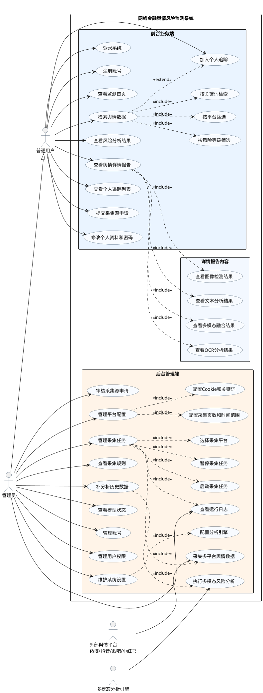
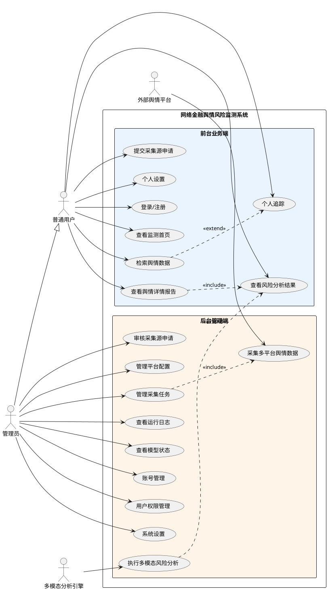

# 网络金融舆情风险监测系统用例图生成说明

本文档用于喂给 ChatGPT、绘图工具或 PlantUML/draw.io 生成工具，生成论文中使用的“网络金融舆情风险监测系统用例图”。图中应突出系统角色、前台业务端与后台管理端边界、普通用户与管理员权限差异，不要把功能无序堆叠。

## 1. 图名建议

论文中图题建议使用：

**图2-X 网络金融舆情风险监测系统用例图**

如果放在第3章，也可使用：

**图3-X 网络金融舆情风险监测系统用例图**

图题放在图下方，图中文字尽量使用中文，字体统一，图形清晰。

## 2. 系统边界

用例图系统边界名称建议写为：

**网络金融舆情风险监测系统**

系统边界内的用例建议按功能区域分组，避免杂乱：

1. 前台业务端
2. 数据采集申请
3. 风险监测与报告
4. 后台管理端
5. 采集任务与分析配置

如果绘图工具支持分区，可在系统边界内用浅色区域区分“前台业务端”和“后台管理端”。

## 3. 参与者设计

### 3.1 主要参与者

用例图中至少应包含两个主要参与者：

1. **普通用户**
   - 代表金融监管人员、平台业务人员、舆情监测人员等前台使用者。
   - 主要查看舆情结果、进行检索、查看详情报告、加入个人追踪、提交采集源申请。
   - 不能启动爬虫、不能修改平台配置、不能查看后台日志、不能管理账号。

2. **管理员**
   - 代表系统维护人员或后台管理人员。
   - 负责平台配置、采集任务、采集申请审核、运行日志、模型状态、账号管理、用户管理、系统设置。
   - 管理员也可以使用普通用户的前台查看功能。

### 3.2 可选外部参与者

如果希望图更完整，可以加入以下外部参与者，但不要画得太复杂：

1. **外部舆情平台**
   - 包括微博、抖音、百度贴吧、小红书。
   - 与“采集多平台舆情数据”用例有关。

2. **多模态分析引擎**
   - 表示 API版、本地版或端到端版分析模块。
   - 与“执行多模态风险分析”用例有关。

说明：MongoDB 数据库一般不建议作为用例图参与者，因为数据库属于系统内部实现细节。如果必须体现数据存储，可在用例名称中写“存储舆情数据”，不要把 MongoDB 画成主要参与者。

## 4. 普通用户用例

普通用户相关用例应放在前台业务端区域。

### 4.1 账号与个人信息

- 登录系统
- 注册账号
- 修改个人资料
- 修改密码

### 4.2 舆情查看与检索

- 查看监测首页
- 查看舆情监测列表
- 按平台筛选舆情
- 按关键词检索舆情
- 按风险等级筛选舆情
- 按分析状态筛选舆情
- 查看风险分析结果
- 查看舆情详情报告

### 4.3 个人追踪

- 加入个人追踪
- 查看个人追踪列表
- 取消追踪舆情

### 4.4 采集源申请

- 提交采集源申请
- 查看采集源列表

注意：普通用户只能提交申请，不能直接配置系统采集平台。

## 5. 管理员用例

管理员相关用例应放在后台管理端区域。

### 5.1 平台与采集源管理

- 管理平台配置
- 配置平台 Cookie
- 配置采集关键词
- 配置采集页数和时间范围
- 审核采集源申请
- 退回采集源申请
- 维护扩展平台

### 5.2 采集任务管理

- 选择采集平台
- 启动采集任务
- 暂停采集任务
- 查看采集任务状态
- 查看运行日志
- 查看采集规则

### 5.3 风险分析与模型管理

- 补分析历史数据
- 查看模型状态
- 配置分析引擎
- 设置分析并发数
- 设置是否自动分析
- 重置分析引擎

### 5.4 账号与用户管理

- 新增账号
- 修改账号信息
- 启用或禁用账号
- 重置密码
- 设置账号角色
- 查看用户操作记录
- 管理用户权限范围

### 5.5 系统设置

- 维护系统运行参数
- 查看系统路径与数据库配置
- 保存系统设置

## 6. 核心用例关系建议

用例图中可以适当使用 include 和 extend 关系，但不要过多。

### 6.1 普通用户侧关系

建议关系如下：

- “查看舆情监测列表” include “按平台筛选舆情”
- “查看舆情监测列表” include “按关键词检索舆情”
- “查看舆情监测列表” include “按风险等级筛选舆情”
- “查看舆情详情报告” include “查看文本分析结果”
- “查看舆情详情报告” include “查看图像检测结果”
- “查看舆情详情报告” include “查看多模态融合结果”
- “查看舆情监测列表” extend “加入个人追踪”

### 6.2 管理员侧关系

建议关系如下：

- “管理平台配置” include “配置平台 Cookie”
- “管理平台配置” include “配置采集关键词”
- “管理平台配置” include “配置采集页数和时间范围”
- “审核采集源申请” extend “退回采集源申请”
- “采集任务管理” include “选择采集平台”
- “采集任务管理” include “启动采集任务”
- “采集任务管理” include “暂停采集任务”
- “采集任务管理” include “查看运行日志”
- “补分析历史数据” include “执行多模态风险分析”
- “系统设置” include “配置分析引擎”
- “账号管理” include “新增账号”
- “账号管理” include “修改账号信息”
- “账号管理” include “重置密码”
- “账号管理” include “设置账号角色”

### 6.3 外部参与者关系

如果加入外部参与者，可按如下方式连接：

- “外部舆情平台” 关联 “采集多平台舆情数据”
- “多模态分析引擎” 关联 “执行多模态风险分析”

其中“采集多平台舆情数据”可以被“采集任务管理” include。

## 7. 推荐图形布局

建议使用横向布局：

```text
普通用户                    网络金融舆情风险监测系统                    管理员
  |            ┌──────────────────────────────────────┐                  |
  |            │ 前台业务端                            │                  |
  |            │ 数据采集申请                          │                  |
  |            │ 风险监测与报告                        │                  |
  |            │ 后台管理端                            │                  |
  |            │ 采集任务与分析配置                    │                  |
  |            └──────────────────────────────────────┘                  |
```

具体布局建议：

1. 普通用户放在左侧。
2. 管理员放在右侧。
3. 系统边界放在中间。
4. 前台用例放在系统边界左半部分。
5. 后台用例放在系统边界右半部分。
6. 外部舆情平台和多模态分析引擎可放在系统边界下方或上方，避免干扰主角色关系。
7. 普通用户与后台管理用例不要直接连接。
8. 管理员可以连接部分前台查看类用例，也可以通过“管理员继承普通用户”表达。

## 8. 颜色与样式建议

为了符合导师建议，图中角色和功能区域要清晰。

建议：

- 普通用户：蓝色或浅蓝色。
- 管理员：橙色或浅橙色。
- 前台业务端用例：浅蓝色区域。
- 后台管理端用例：浅橙色区域。
- 外部系统：浅灰色。
- include/extend 关系使用虚线。
- 普通关联使用实线。
- 系统边界使用黑色或深灰色矩形。

不要使用过多颜色，保持论文图清晰、正式。

## 9. 应避免的问题

生成用例图时不要出现以下问题：

1. 不要把所有功能无序堆在一起。
2. 不要让普通用户连接后台管理功能。
3. 不要把运行日志、平台配置、系统设置放到普通用户侧。
4. 不要虚构短信预警、邮件推送、导出PDF、分布式部署等未实现功能。
5. 不要把真实 Cookie、API Key 或本地密钥写入图中。
6. 不要把 MongoDB 作为核心参与者画得过于突出，它属于内部实现。
7. 不要使用过小字体，论文打印后要能看清。
8. 不要把“风险预警展示”画成完全独立的新模块，本系统中它与“风险分析”和“舆情监测展示”整合。

## 10. 推荐用例清单精简版

如果图太拥挤，优先保留以下用例：

### 普通用户

- 登录系统
- 查看监测首页
- 检索舆情数据
- 查看风险分析结果
- 查看舆情详情报告
- 加入个人追踪
- 提交采集源申请
- 修改个人信息

### 管理员

- 审核采集源申请
- 管理平台配置
- 管理采集任务
- 查看运行日志
- 查看模型状态
- 管理账号
- 管理用户权限
- 维护系统设置

### 外部参与者

- 外部舆情平台
- 多模态分析引擎

## 11. 可直接喂给 ChatGPT 的生成提示词

可以将下面提示词复制给 ChatGPT，用于生成用例图说明、PlantUML 或 draw.io 图：

```text
请为“网络金融舆情风险监测系统”生成一张论文用 UML 用例图。

系统边界名称为“网络金融舆情风险监测系统”。参与者包括普通用户、管理员，可选外部参与者包括外部舆情平台和多模态分析引擎。普通用户使用前台业务端，管理员使用后台管理端，管理员也可以查看前台监测结果。

普通用户用例包括：登录系统、注册账号、查看监测首页、检索舆情数据、查看风险分析结果、查看舆情详情报告、加入个人追踪、查看个人追踪列表、提交采集源申请、修改个人资料和密码。

管理员用例包括：审核采集源申请、管理平台配置、配置Cookie和关键词、管理采集任务、启动采集任务、暂停采集任务、查看运行日志、查看采集规则、补分析历史数据、查看模型状态、配置分析引擎、管理账号、管理用户权限、维护系统设置。

关系要求：普通用户不要连接后台管理用例；管理员连接后台管理用例。检索舆情数据可include平台筛选、关键词检索、风险等级筛选；查看详情报告可include文本分析结果、图像检测结果、OCR分析结果、多模态融合结果；管理采集任务可include选择平台、启动采集、暂停采集、查看日志；管理平台配置可include配置Cookie、配置关键词、配置采集页数和时间范围；补分析历史数据可include执行多模态风险分析。外部舆情平台关联采集多平台舆情数据，多模态分析引擎关联执行多模态风险分析。

布局要求：普通用户放左侧，管理员放右侧，系统边界放中间；前台用例放系统边界左半部分，后台用例放右半部分；使用颜色区分前台业务端和后台管理端；整体清晰简洁，适合本科毕业论文插图。

不要虚构短信预警、邮件推送、PDF导出、分布式部署等未实现功能，不要出现真实Cookie或API Key。
```

## 12. PlantUML 示例

如果需要让 ChatGPT 或 PlantUML 直接生成图，可以参考下面代码。实际绘图时可根据页面空间适当删减部分用例。



## 13. 更适合论文插图的精简 PlantUML

如果上一版太密，可以使用下面精简版，更适合论文正文。



